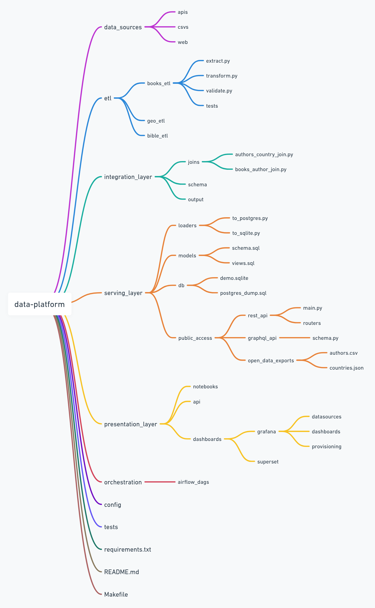
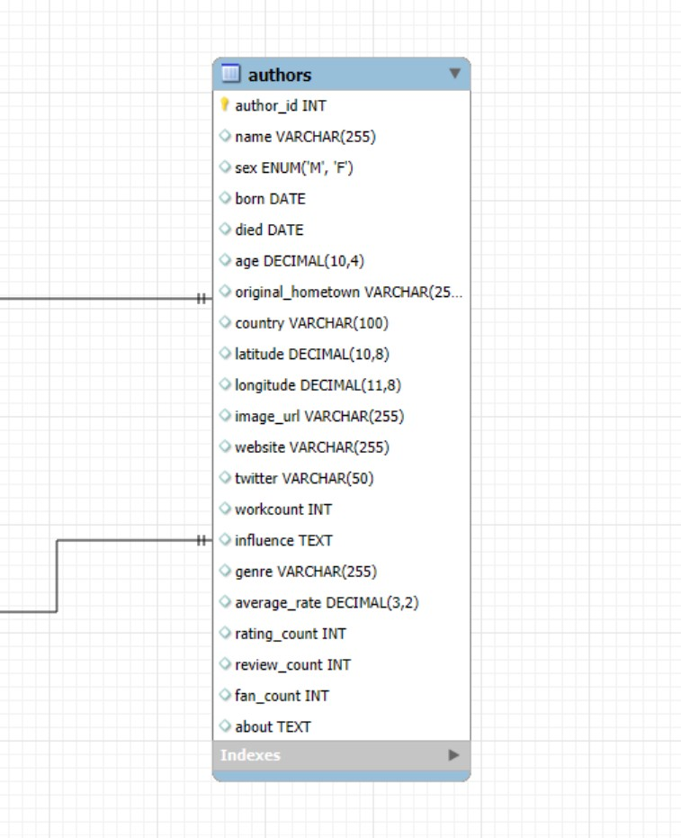

# 📚 Books ETL Pipeline

## 🌟 Overview

The **Books ETL Pipeline** is a project designed to extract, transform, and load (ETL) data from Goodreads to analyze book authors. The pipeline uses **SQL** for database operations, **Python** for scripting and visualization, and **Airflow** for orchestration.

## 🛠️ ETL Workflow

Below is the detailed ETL workflow, including all significant layers:


```
+---------------------------+       +---------------------------+       +---------------------------+
|   Data Sources Layer      | --->  |        ETL Layer          | --->  |   Integration Layer       |
| (APIs, Web, CSVs, DBs)    |       | (Extract, Validate,       |       | (Joins, relaciones, FKs)  |
|                           |       |  Transform, Test,         |       |                           |
|                           |       |  Orchestrated by Airflow) |       |                           |
+---------------------------+       +---------------------------+       +---------------------------+

+---------------------------+       +---------------------------+
|      Serving Layer        | --->  |    Presentation Layer     |
| (DB relacional, DWH, S3)  |       |  (BI, APIs, Dashboards,   |
|                           |       |   Grafana)                |
+---------------------------+       +---------------------------+
```

### Explanation of Layers:
1. **Data Sources Layer**:  
   - Collects raw data from various sources such as the Goodreads API, CSV files, and other external APIs.

2. **ETL Layer**:  
   - Handles the core ETL process:
     - **Extract**: Fetches data from the sources.
     - **Validate**: Ensures data quality and consistency.
     - **Transform**: Cleans, formats, and enriches the data.
     - **Load**: Inserts the processed data into the database.

3. **Integration Layer**:  
   - Establishes relationships between tables, applies joins, and enforces foreign key constraints to ensure data integrity.

4. **Serving Layer**:  
   - Stores the processed data in a relational database (e.g., MySQL) or a data warehouse (DWH) for efficient querying and analysis.

5. **Presentation Layer**:  
   - Provides insights through dashboards (e.g., Streamlit), APIs, or business intelligence (BI) tools for end-users.

This enhanced workflow provides a comprehensive view of the data pipeline, from raw data ingestion to actionable insights.



## 🗄️ Database Structure

The database is structured to store information about books, authors, reviews, and ratings. Below is the schema:



## 🚀 Features

- 📊 **Data Analysis**: Analyze metrics such as average ratings, number of reviews, and fan counts.
- 🔄 **Automated Workflow**: Orchestrated using **Apache Airflow**.
- 📂 **Backup & Restore**: Easily back up and restore the database.
- 🌐 **Streamlit Dashboard**: Visualize insights interactively.


## 🐳 Docker Commands

### 🔄 **Recreate the System from Scratch**
```bash
# 1. Create ETL secrets
scripts/create_secrets.sh

# 2. Clean up Docker environment
make clean

# 3. Restart the ETL pipeline
make docker-restart

# 4. Recreate Grafana
make grafana-recreate

# 5. Restart Grafana
make grafana-restart
```

### 📜 **View Logs**
```bash
docker logs <container_name>
```

Examples:
```bash
docker logs airflow-webserver
docker logs mysql
```

### 🛠️ **Other Useful Commands**
- View running containers: `docker ps`
- Access a container: `docker exec -it <container_name> /bin/bash`
- Stop and remove containers, networks, and volumes: `docker compose down --volumes`
- Rebuild images without cache: `docker compose build --no-cache`
- Restart containers: `docker compose restart`


## 🌀 Airflow Setup

### ⚙️ **Installation**
```bash
sudo apt update && sudo apt install -y python3-pip python3-venv

cd /home/jesus/proyectos/books-etl-pipeline
python3 -m venv venv
source venv/bin/activate
pip install --upgrade pip

export AIRFLOW_HOME=/home/jesus/proyectos/books-etl-pipeline/airflow
pip install "apache-airflow==2.8.1" --constraint \
  "https://raw.githubusercontent.com/apache/airflow/constraints-2.8.1/constraints-$(python -c 'import sys; print(\".\".join(map(str, sys.version_info[:2])))').txt"
```

### 🗄️ **Configure Airflow Database**
```bash
# Initialize Airflow database
airflow db init

# Create an admin user for the Airflow UI
airflow users create --username admin --firstname Admin --lastname User --role Admin --email admin@example.com --password admin
```

### 🚀 **Launch Airflow**
```bash
# Start the webserver
airflow webserver --port 8793

# Start the scheduler
airflow scheduler
```

Access the Airflow UI at: [http://localhost:8793](http://localhost:8793)


## 📜 Requirements

Install dependencies:
```bash
pip3 install -r requirements.txt
```

## 📚 Data Sources

- **Authors**: [Kaggle Dataset](https://www.kaggle.com/datasets/choobani/goodread-authors)


## 🧑‍💻 Contributing

Feel free to fork this repository and submit pull requests. Contributions are welcome!

## 📄 License

This project is licensed under the MIT License.